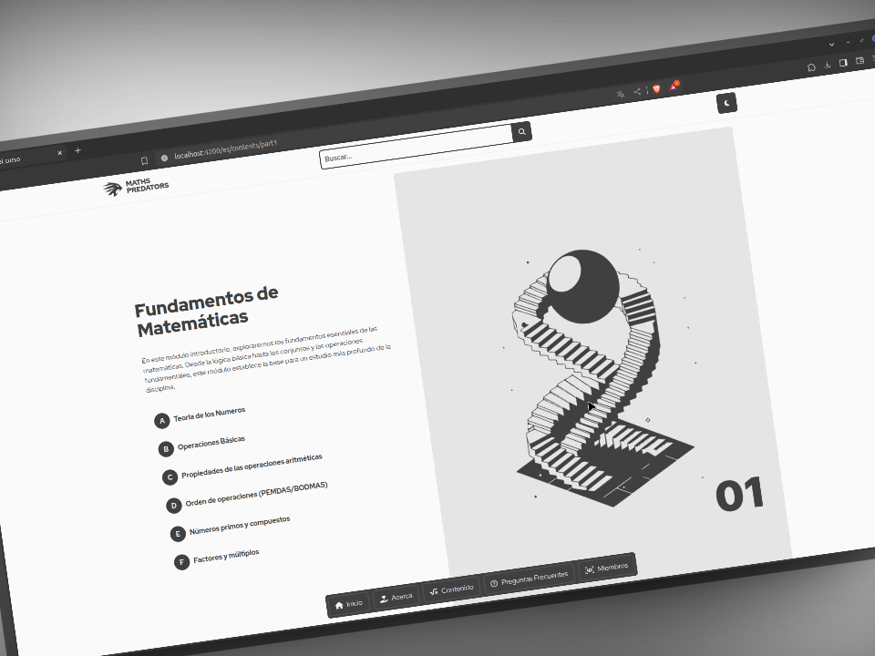

# MathsCourses - Plataforma de Cursos de Matemáticas desde Cero

Este proyecto fue generado con [Angular CLI](https://github.com/angular/angular-cli) versión 16.2.10 y utiliza Tailwind CSS para el diseño.

## Servidor de Desarrollo

Para iniciar el servidor de desarrollo, ejecuta `ng serve`. Luego, navega a `http://localhost:4200/`. La aplicación se recargará automáticamente si realizas cambios en los archivos fuente.

## Estructura de Código

Para generar un nuevo componente, utiliza `ng generate component nombre-componente`. También puedes utilizar `ng generate directive|pipe|service|class|guard|interface|enum|module`.

## Construcción

Para construir el proyecto, ejecuta `ng build`. Los artefactos de construcción se almacenarán en el directorio `dist/`.

## Ejecución de Pruebas Unitarias

Para ejecutar las pruebas unitarias a través de [Karma](https://karma-runner.github.io), ejecuta `ng test`.

## Ejecución de Pruebas End-to-End

Para ejecutar las pruebas end-to-end a través de una plataforma de tu elección, ejecuta `ng e2e`. Antes de utilizar este comando, asegúrate de agregar un paquete que implemente capacidades de pruebas end-to-end.

## Ayuda Adicional

Para obtener más ayuda sobre Angular CLI, utiliza `ng help` o consulta la página [Angular CLI Overview and Command Reference](https://angular.io/cli).
